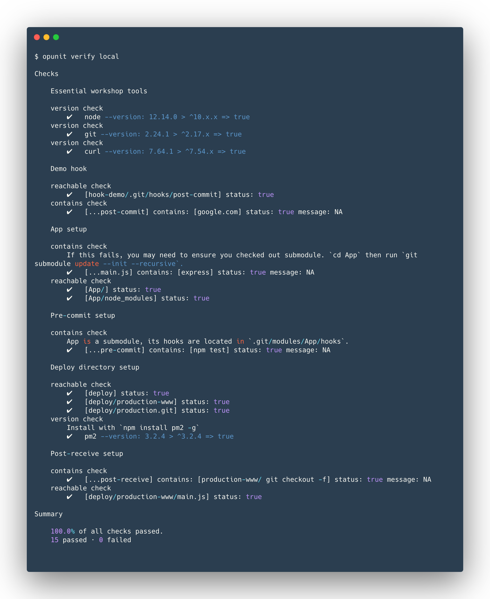
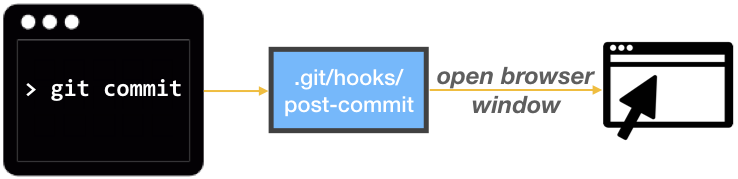
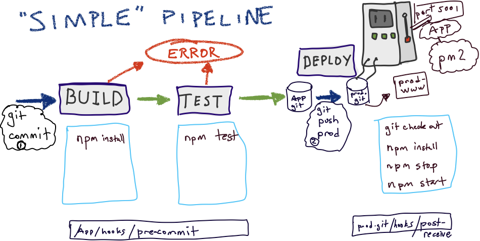
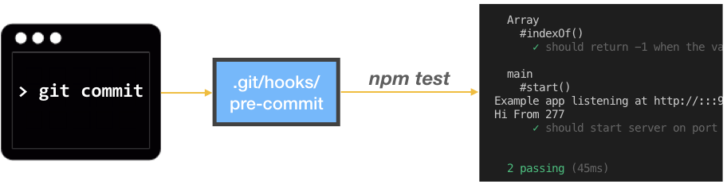
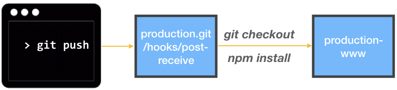
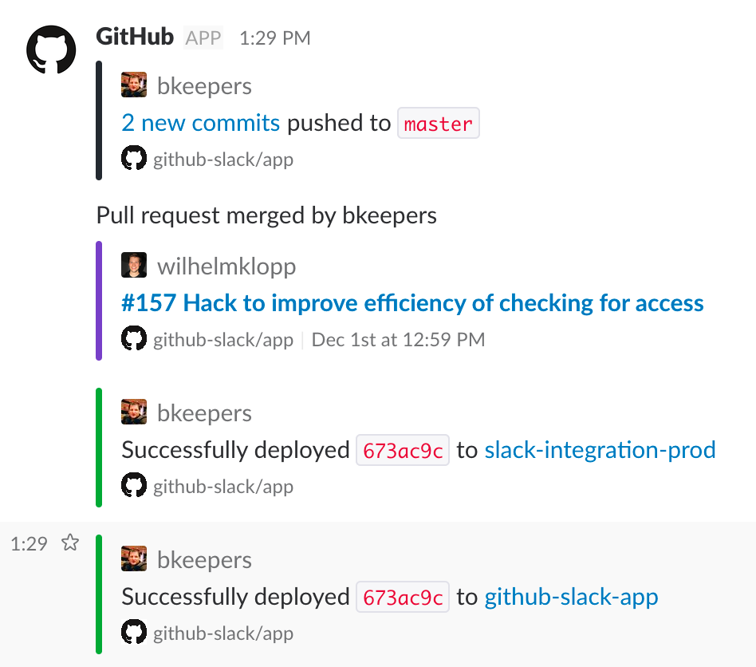

<!--
targets:
    - type: local
      name: local
      cwd: .
-->

# Pipelines

In this workshop, we'll cover the basics of setting up a simple delivery pipeline, consisting of git hooks and shell commands.


### What and why pipelines?

A *delivery pipeline* is a workflow system for building, validating, and deploying changes into a production environment. Pipelines are essential for supporting the paradigm of *continuous deployment*. A pipeline consists of stages, which typically represents a software engineering process, such as testing, static analysis, acceptance testing, or code review. When fully automated, pipelines allow commits to source code to be automatically tested and "seamlessly" deployed into production environments within minutes.

In practice, the ecosystem for building pipelines can be quite complex.


While more advanced pipelines can be created with tools like Spinnaker and Jenkins, using *simple tools*—such as git and shell commands—can get the job done.

## Workshop

### Before you get started

1. Import this as a notebook or clone this repo locally.  

Also, ensure you [install latest version of docable](https://github.com/ottomatica/docable-notebooks/blob/master/docs/install.md), with multi-target support!

```bash
docable-server import https://github.com/CSC-DevOps/Pipelines
```

If you clone this repo with, use `git clone --recursive https://github.com/CSC-DevOps/Pipelines`. Note, `--recursive` is required, as the App directory is a submodule.

2. You will want to make sure the App submodule is tracking changes in master, otherwise you will have [a detached head](https://stackoverflow.com/a/36375256/547112).  

If you did not use `--recursive` flag, or are using a notebook, run the following!

```bash | {type: 'command'}
git submodule update --init --recursive
```

2. Provision a virtual machine for the workshop. We have provided a bakerx.yml file to help setup the environment of the VM.

```yml | {type: 'info', range: {start: 7, end: 8}}
name: app_prod
image: focal
ip: 192.168.33.15
up: |                      
  apt update
  # 😬
  curl -sL https://deb.nodesource.com/setup_14.x -o nodesource_setup.sh | sudo bash
  sudo apt install nodejs npm -y
  npm install -g pm2
```

```bash | {type: 'command', stream: true, failed_when: 'exitCode != 0'}
bakerx run
```


### Checking progress on workshop

To help you identify if issues exist with the current setup, you can run the following command to check:

```bash | {type: 'command', stream: true}
opunit verify -i inventory.yml
```

<!--

-->

## Hooks

A hook is a mechanism for specifying an action that occurs in response to an event. The action can be used to trigger other events. Thus, hooks can be composed together in order to create a simple pipeline.

Git provides [a hook mechanism](https://git-scm.com/book/en/v2/Customizing-Git-Git-Hooks) that can be used to customize responses to events, such as commits or pushes. A hook is run as a shell script in response to certain events that occur when git processes changes to source code.

### Creating git hooks

To create a new git hook, one simply creates a new shell script inside the `.git/hooks/` directory. The shell script should be the same name as the corresponding event defined by git.

Some example events include:

* **pre-commit:** This hook will run when `git commit` is performed on a repo. The hook can inspect the commit and reject it (by exiting with a non-zero exit code, e.g., `exit 1`).
* **post-commit:** This hook will run after a commit is processed by the local repository.
* **post-receive:** This hook will run on a remote repository after a push has successfully been received and processed. This hook can be used for notifications or trigger other processes, such as a build.

### Practice

We will illustrate a simple hook by opening a webpage whenever a commit is created in a repo.



Inside a new directory (`mkdir hook-demo`), create a new git repository with `git init`. Create a post-commit file located in "hook-demo/.git/hooks/post-commit". Finally, you should ensure the post-commit script is exectuable, by running `chmod +x post-commit`.

The script for post-commit might look something like this:

```sh
#!/bin/sh

# In Mac
open https://google.com/
# In Windows
# start https://google.com/
# In Linux
# xdg-open https://google.com/
```

``` | {type: 'terminal'}
```

Trigger the commit by create a simple commit in hook-demo. (`touch demo`; `git add demo`; `git commit -m "init"`. You should see the webpage open.)


## A Simple Pipeline

We will create a simple pipeline that runs tests, installs, and "deploys" an application into production based on a commit.



### Our target application

Inside the `App/` directory, there is a simple node.js application. Go ahead and setup the app locally by running `npm install` inside the App/ directory.

Before we make any changes to code, let's run `git checkout master`, which will make sure we can get things to the main branch, otherwise, by default, our commits will be to a detached head.

Run the command: `npm start`, you should see output that looks something like:

```
$ npm start

> app@0.9.1 start .../App
> node main.js start 5001

Example app listening at http://:::5001
```

``` | {type: 'terminal'}
```


Visit http://localhost:5001 in your web browser. You should see the message, "Hi From &lt;random number&gt;"

Terminate the application (Control-C). Verify you can run the test with `npm test` and see two tests passing.

### Adding a build and test stage.

We will add a **pre-commit** hook for `/App` that will cancel a commit if `npm test` fails. Because `/App` is a submodule, its hooks are located in a slightly different location: `.git/modules/App/hooks`.



```sh
#!/bin/bash

npm install
# Get the exit code of tests.
if npm test; then
  echo "Passed tests! Commit ✅ allowed!"
  exit 0
fi
echo "Failed npm tests. Canceling 🚫 commit!"
exit 1
```

Change the message in App/main.js from "Hi From" to "Bye From". 

Attempt to commit the file (`git add main.js`; `git commit -m "checkin"`). Confirm the tests fail, preventing the commit from being added.

> ❗️Not working as expected? Make you made the pre-commit script executable (`chmod +x pre-commit`)

``` | {type: 'terminal'}
```

## Prepare app_prod server for deploy stage

We will prepare our app_prod server for receiving updates from our pipeline.
We will take advantage of git's `post-receive` hook and *bare repositories*.



On our app_prod server, we need to create two directory paths (`mkdir -p`):

* /srv/production.git — This will serve as our remote repository.
* /srv/production-www — This will hold the contents of our deployed web app.

### Creating bare repository

To create the production.git, we need to do something a little different. We need to create a *bare repository*, that is, a repository without a staging area and working tree. Instead, a bare repository only holds git objects, from which code can be extracted as needed. One advantage of a bare repository is that it exposes the hook architecture, while helping avoid issues, such as having a merge issues on production server.

Inside `/srv/production.git`, run `git init --bare`.

``` | {type: 'terminal', 'background-color': '#7e050d'}
```

### Preparing post-receive hook

To hold the current version of software, we will use the production-www, and extract it from the bare repository using `git checkout`.

We will use the **post-receive** event, to create a hook to perform the git checkout operation for us.

Create the following post-receive hook inside /srv/production.git:

```sh
#!/bin/sh
echo "Current location: $GIT_DIR"
GIT_WORK_TREE=/srv/production-www/ git checkout -f master
echo "Pushed to production!"
cd /srv/production-www
npm install --production
```

This script copies over the content of the latest code in production.git into production-www, and installs the appropriate dependencies for the web app.

This script does not run the web app, however. To do that, we will use an utility, [pm2](http://pm2.keymetrics.io/docs/usage/quick-start/). `pm2` will ensure that the web app will stay running, even if it crashes.

We add the following steps to our script, after npm install:

```sh
npm run stop
npm run deploy
```

The details for how pm2 is run using [the process.json](http://pm2.keymetrics.io/docs/usage/application-declaration/#json-format), can be found in package.json:

```json
  "scripts": {
    "test": "mocha",
    "start": "node main.js start 5001",
    "deploy": "pm2 start process.json",
    "stop": "pm2 stop process.json"
  },
```

### Adding a git remote; Trying it out

Finally, we need to link the App repository with the *remote* production.git repository. While this is still located on the same machine, in practice, the process would be similar for a remote machine hosting a git repository.

Inside the App/ directory, run the following commands:

    git remote add prod ssh://vagrant@192.168.33.15/srv/production.git

Update the App main.js code's message, to be "Hi From production" and commit locally.

You can now push changes in App to remote repo in the following manner.

    GIT_SSH_COMMAND="ssh -i ~/.bakerx/insecure_private_key" 
    git push prod master

You should be able to visit http://192.168.33.15:5001/ and see the changes you made in app, and pushed into production!

``` | {type: 'terminal', 'background-color': '#7e050d'}
```

## Concept questions

* Trace the flow of a commit from the local App repository to running code in production. Can you see how it maps to the pipeline diagram?
* What are some issues that might occur if required to pass tests in a pre-commit hook?
* What are some issues that could occur when running npm install (when testing), and then npm install again in deployment?
* Why is pm2 needed? What problems does this solve? What problems other problems might exist in more complex applications that our pipeline does not address?
* What are other stages of the pipeline that are missing?

## Next steps.

Instead of just targeting local resources and services, we can easily trigger other remote services and tools.

Using, `curl`, we can send HTTP requests to initialize all kinds of tasks. For example, we could modify our hooks to trigger a build on a jenkins server. 

```
curl -X POST http://YOUR_JENKINS_URL/job/YOUR_JOB/build?TOKEN=YOUR_API_TOKEN
```

or send an email:

```
curl smtp://mail.example.com --mail-from myself@example.com --mail-rcpt
receiver@example.com --upload-file email.txt
```

Because you may not have direct access to a git server, such as a repository hosted on GitHub, you can alternatively configure [WebHooks](https://developer.github.com/webhooks/). WebHooks provide the ability to generate HTTP requests with payloads that can allow integration with many different services and tools.

Pipeline events can be published on places like Slack.


